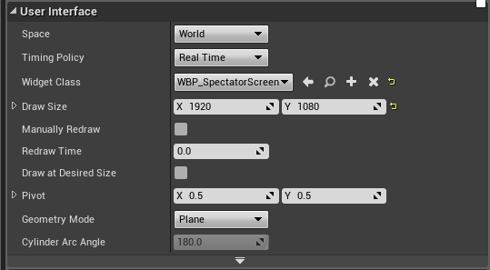
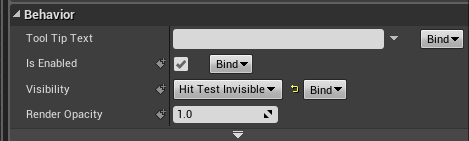
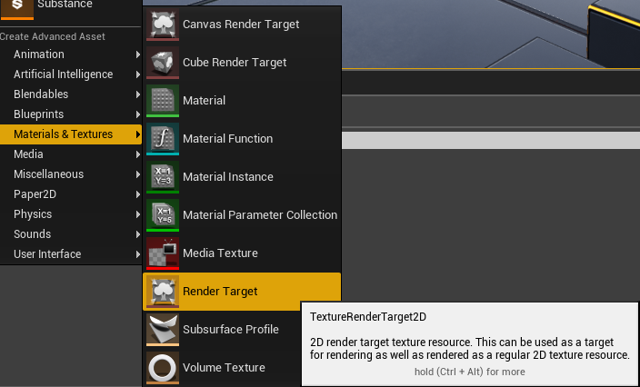

# Purpose

Asymmetrical virtual reality applications and games often include a participant with a virtual reality headset on and another participant using either mouse and keyboard or a gamepad.
In Unreal Engine it's possible to make this, but it involves a little more work than you'd initially anticipate.
This project includes a sample of a virtual reality application in which one user can look at an environment in virtual reality and another can use a virtual cursor to interact with the game through a UMG widget on a spectator screen.

# Setup Explanation

## Player Pawn Setup

1. Add a `UWidgetComponent` to your player pawn.
   This will be used to render the widget for the spectator screen.
   In the sample project, this component was added as a child to the camera for debugging purposes, but you will probably want to attach it directly to the root and position the widget so that it is facing outward and thus invisible.
   While the `UWidgetComponent` doesn't necessarily need to be on the player pawn, I found it a reasonable, organized place to put it.
   If you feel your player pawn is already crowded with too much functionality, then put the `UWidgetComponent` on a unique actor in the world that can be easily found and referenced.

1. Set up the the user interface settings of the widget component.
   The first thing we will do is set the draw size of the component to be 1920x1080 or to whatever your target draw size is.
   If your spectator is using a higher screen resolution, this means they'll get a lower quality widget component, so you may want to adjust this by getting the screen resolution of the spectator display.
   If you don't use 1920x1080, make sure when you make the calls to the `GetAbsoluteLocationForCursorWidgetFromMousePosition` and other functions in the library that you adjust the widget resolution accordingly, as these functions will default to 1920x1080.

   

1. Add a `UWidgetInteractionComponent` as a child of the previously add `UWidgetComponent`.
   This component *must* be a child as its position will be set relative to its parent component.
   The widget interaction will be used to provide interactivity for the fake cursor.
   This isn't the most efficient approach as a line trace is being employed; however, if your application is being run on a computer than can handle a virtual reality render and an extra spectator render, I think an extra line trace can be forgiven.

1. Set up a function on tick that will set the cursor and widget interaction positions from the absolute location for cursor widget from mouse position and the offset position for the middle pivot.
   An example of such a function is below in the scrollable viewport as well as an explanation of why we're doing all this.

<iframe src="https://blueprintue.com/render/y5q-09au" scrolling="no" width=100% height=400px></iframe>

## Widget Setup

1. Create a widget blueprint or a `UUserWidget`.

1. Add a `UImage` behaving as a virtual cursor as the very last widget in the widget blueprint so that it shows on top of all other items and is a child of the root canvas. 
   Under the Behavior panel, set the visibility to "hit test invisible."
   We need to do this because the widget interaction component will be tracing onto the widget directly on the center of this widget.
   If the widget were visible to hit tests, then the widget interaction would only ever hit this widget and thus not be able to interact with the underlying UI elements.

   

1. For convenience, create a function to set the cursor widget's position.
   Since we parented the cursor to the top canvas of our widget, its widget slot is a `CanvasPanelSlot`.
   Get the widget's slot, cast it, and set the position using `CanvasPanelSlot::SetPosition(FVector2D InPosition)`.
   For minorly improved performance, you may also keep a reference to the already cast slot.

1. In the `UWidgetComponent` that will be used to render the spectator screen, set up the user widget to be a reference to the widget blueprint we just created.

## Switching Spectator Modes

This optionally sets up a behaviour to switch between watching the VR perspective and using a control interface.
Alternatively, you can just set the spectator texture and spectator mode at begin play and leave it there.
If you take this route, I recommend doing so in the player pawn's begin play to ensure everything necessary for the behaviour has been initialised.

1. Add a `bIsShowingTexture` boolean to your actor holding the widget component.

1. Add a function that responds to player input such that if `bIsShowingTexture` is true the spectator screen mode is set to some VR view mode and `bIsShowingTexture` is set to false.
   If `bIsShowingTexture` is false, set the spectator screen mode to texture and set the texture to be the render target of your widget.

This is demonstrated in Blueprints in the below frame and in CPP underneath that.

<iframe src="https://blueprintue.com/render/hzemqrkt" scrolling="no" width=100% height=400px></iframe>

```cpp
if(bIsShowingTexture)
{
	UHeadMountedDisplayFunctionLibrary::SetSpectatorScreenMode(ESpectatorScreenMode::Undistorted);
	bIsShowingTexture = false;
else
{
	if (Widget != nullptr && WidgetRenderComponent != nullptr)
	{
		UHeadMountedDisplayFunctionLibrary::SetSpectatorScreenMode(ESpectatorScreenMode::Texture);
		UHeadMountedDisplayFunctionLibrary::SetSpectatorScreenTexture((UTexture*)WidgetRenderComponent->GetRenderTarget());
		bIsShowingTexture = true;
	}
}
```

## Render Target Setup

You can optionally add a render target that shows what the VR user is seeing or a free spectator camera on your widget.
We'll use a user interface material to bypass any gamma issues.

1. Add a `USceneCapture2D` to your player pawn or to your scene.

1. Create a `UTextureRenderTarget2D` as an asset.
   You may also make this dynamically, but it's a lot easier to go ahead and have a single render target asset for each of your scene captures!

   

1. Set the texture render target's size x and y to be 1920x1080.

1. Set the render target reference for the scene capture to the render target asset.
   This may be found under "Scene Capture" settings.

1. Also under "Scene Capture" settings, set the capture source to be SceneColor(HDR) in RGB, 0 in alpha.

1. Create a new material for presenting this texture in the UI.

   1. Set the material domain for your new material to "User Interface."

   1. Set the blend mode to opaque.

   1. Add a texture sample and set the texture to our recently created texture render target.

   1. Set the final color to be the output of our texture sample.

1. Add a `UImage` widget in your widget blueprint and set its material to the material you just created.

# Code Reference

There are only 3 functions in the blueprint library for this codebase, so rather than provide a full docsite for these functions, they are presented below with their comments.

```cpp
/**
* Calculates the expected cursor position from a viewport of some size to a widget of some size.
*
* @param PlayerController The player controller reference from which to get the mouse position.
* @param WidgetSize The size of the widget for which the cursor position should be calculated.
* @return Returns the "absolute" location for the widget as a FVector2D offset from the widget origin of 0,0 (top left corner).
*/
UFUNCTION(BlueprintPure)
	static const FVector2D GetAbsoluteLocationForCursorWidgetFromMousePosition(class APlayerController* PlayerController, const FVector2D WidgetSize);
/**
* Retargets a cursor's absolute position to a 3D widget given that in order for widget interaction to work correctly, the widget component should have a pivot of (0.5, 0.5).
*
* @param AbsoluteCursorLocation The position of the cursor as an offset from the widget origin.
* @param TargetResolution The target resolution of the widget.
* @return The cursor location corrected for the pivot offset.
*/
UFUNCTION(BlueprintPure)
	static const FVector2D OffsetCursorWidgetFromMouseLocationForMiddlePivot(const FVector2D AbsoluteCursorLocation, const FVector2D TargetResolution = FVector2D(1920.f, 1080.f));
/**
* Gets the spectator display resolution for both in editor and in game
*
* @return The display resolution.
*/
UFUNCTION(BlueprintPure)
	static const FVector2D GetSpectatorDisplayResolution();
```

# Credits

<div>Icons made by <a href="https://www.flaticon.com/authors/smashicons" title="Smashicons">Smashicons</a> from <a href="https://www.flaticon.com/" 			    title="Flaticon">www.flaticon.com</a> is licensed by <a href="http://creativecommons.org/licenses/by/3.0/" 			    title="Creative Commons BY 3.0" target="_blank">CC 3.0 BY</a></div>
